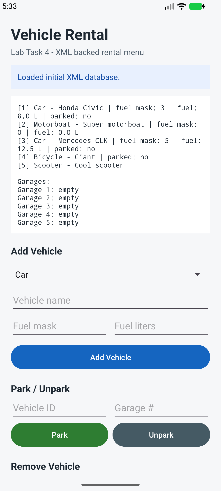
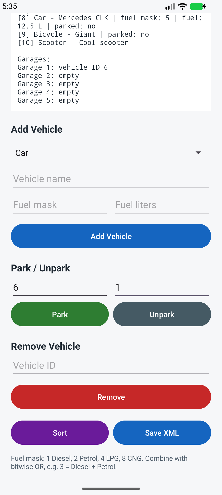
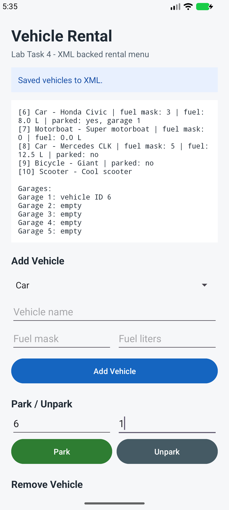

# Vehicle Rental

Course name: Introduction to Mobile Systems  
Lab number: Lab Task 4  
Student name: Cem Cakir  
Student ID: 44463

Vehicle Rental is an Android Studio project written in Java. It implements an object-oriented vehicle rental system with abstract classes, interfaces, inheritance, polymorphism, `ArrayList` storage, multi-criteria sorting, garage parking, combustion fuel bitmasks, and XML persistence. The Android screen acts as the required menu: it lets the user print vehicles, add vehicles, park or unpark parkable vehicles, remove vehicles, sort the list, and save the XML database.

## Fuel XML Mapping

The XML `fuelType` value is stored as the same bitmask used by the app:

- `1` = Diesel
- `2` = Petrol
- `4` = LPG
- `8` = CNG
- Combined fuels use bitwise OR, for example `3` = Diesel + Petrol.

## Screenshots

| Main screen | Park feature | Save result |
| --- | --- | --- |
|  |  |  |

## APK

GitHub Release APK link: https://github.com/Agueria/VehicleRental/releases/tag/lab-task-4

The APK attached to the release is built from this project with:

```bash
./gradlew assembleDebug
```

## Build And Test

Use Android Studio or the Gradle wrapper:

```bash
./gradlew assembleDebug
./gradlew testDebugUnitTest
./gradlew connectedDebugAndroidTest
```

The unit tests cover IDs, fuel bitmasks, refueling, parking references, removal, sorting, and XML load/save. The connected Android tests launch the Activity and verify the initial XML database plus add, park, sort, remove, and save menu operations.
